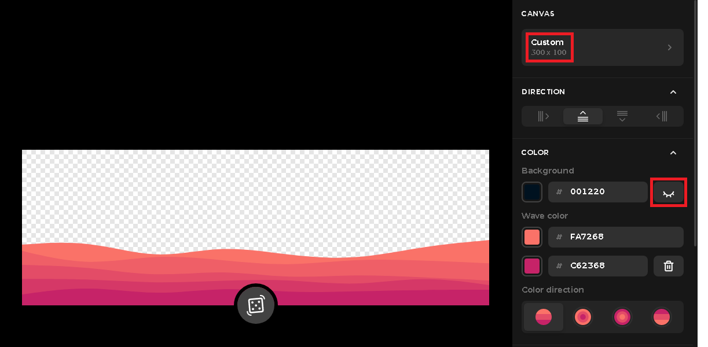

# First Steps
Install the requirements in the ```requirements.txt``` file in the root directory, then go to client directory and run ```npm install```. After that, create a ```credentials.json``` file in the root directory and create the following values:

- ```SECRET_KEY``` - Any value you want, but is recommended to generate one with a safe method
- ```REDIS_HOST``` - The host of the redis instance you're using
- ```REDIS_PASSWORD``` - The password of the redis instance you're using
- ```REDIS_PORT``` - The port of the redis instance you're using

To get the following values, you need to follow the steps to create an app in the spotify dashboard - https://developer.spotify.com/documentation/web-api/quick-start/

- ```CLIENT_ID``` - The public client id of the spotify app you created
- ```CLIENT_SECRET``` - The secret key of the spotify app you created
- ```REDIRECT_URI``` - ```http://localhost:3000```
- ```SCOPES``` - The scopes of the spotify app you created (these have to be put - ```user-read-currently-playing user-read-recently-played user-top-read user-library-read```)

# How to run
Open two terminals

- In the first one, run ```python app.py``` to run the api
- In the second, run ```cd client``` and ```npm start``` to run the client

# How to run in production mode
- Change the ```REDIRECT_URI``` value in the ```credentials.json``` file to ```http://127.0.0.1:5000```
- Cd to the ```client``` folder and, if you're on windows, run ```npm run winBuild```, if you're on linux, run ```npm run build```, that will transform all react scripts into normal html, css and javascript files
- Cd back to the root directory and run ```python app.py```, there's no need to run react on the client side because flask renders the content in the build folder created on the previous step

# How to create a new page
- Let's suppose you want to create an "Add Friends" page
- Go to the ```src``` directory and search for the ```Pages``` directory
- There, create a new folder called ```AddFriends``` and two files, an ```add-friends.tsx``` file and an ```add-friends.css``` file inside of it
- Write the page component with the following pattern:
```Typescript
import {React} from 'react';
import {useState,useEffect} from 'react'; // this is optional, obviously, but it's just a reminder that these shouldn't be imported in the same line as React class

import './add-friends.css';

function AddFriends() {
  const [something,setSomething] = useState();
  
  useEffect(() => {
    ...
  })

  return (
    <></>
  )
}

export default AddFriends;
```
- After the component is created and exported, go to the ```index.ts``` file in the Pages directory and write:
```Typescript
import AddFriends from './AddFriends/add-friends';

export {...,AddFriends};
```
- Then go back to the ```src``` directory and go to the ```App.tsx``` file, there you add the route for your page:
```Typescript
import {...,AddFriends} from './Pages';
...

function App() {
  ...
    <Route path="/add-friends" element={<AddFriends />}></Route>
}
```
- After that, go to the ```app.py``` file in the root directory, there you need to add the new ```add-friends``` route:
```Python
@app.route('/add-friends')
```

# How to create a new wave
- You firstly need to associate the wave with a genre key, to do that, you need to search for spotify genre keys, you can do it manually by looking at the genre seeds of your top items <a href="https://developer.spotify.com/console/get-current-user-top-artists-and-tracks/">here</a>
- After you have gotten the genre key, open <a href="haikei.app" target="_blank">haikei.app</a> and search for the option "Layered Waves"
- There you should create an wave with darker colors below and clearer colors above, also with these configs:



- Once you have found a good color palette, download the svg file and name it this way: ```{YOUR GENRE KEY HERE}-waves.svg```, then put the file in the ```Assets/Svg``` directory found in the ```src``` directory
- After this, go to the ```Helpers``` directory in ```src``` directory and go to the ```getTopGenre.ts``` file, there you assign your genre key in the ```genreKeyWords``` const, this way:
```Typescript
const genreKeyWords = [...,'{YOUR GENRE KEY HERE}'];
```
- Then go to the ```profile.css``` file in the ```Pages/Profile``` directory, there search for the wave classes, then put your wave class this way:
```Css
.wave-{YOUR GENRE KEY HERE} {
  background-image: url(../../Assets/Svg/{YOUR GENRE KEY HERE}.svg);
}
```
