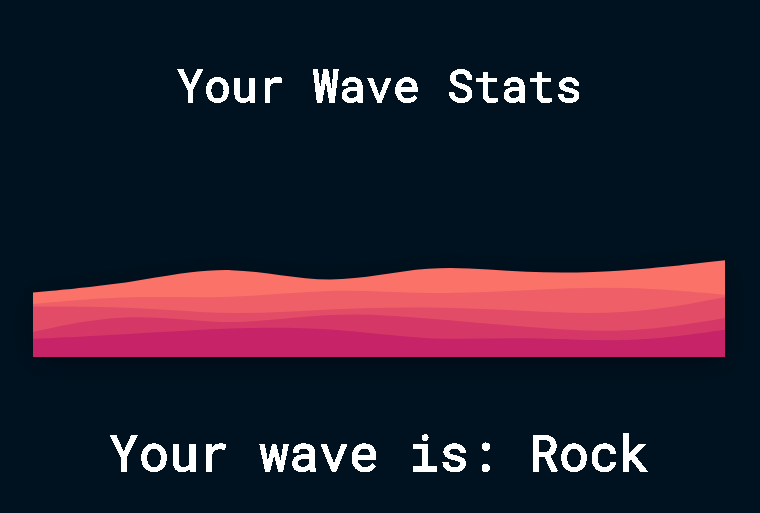

# Wave Stats
Analyse your wave status in spotify!

# Introduction
Welcome to Wave Stats, learn more about your musical preferences!





# Waves Available

Rock Waves


Pop Waves


Rap Waves


Blues Waves


Bossa Nova Waves


Jazz Waves


Alternative Waves


Emo Waves


Classical Waves


Country Waves


Generic Waves

# Technologies Used
- React: https://reactjs.org
- Typescript: https://www.typescriptlang.org
- Flask: https://flask.palletsprojects.com/en/2.2.x/
- Redis: https://redis.io

# First Steps
Install the requirements in the ```requirements.txt``` file in the root directory, then go to client directory and run ```npm install```. After that, create a ```credentials.json``` file in the root directory and create the following values:

- ```SECRET_KEY``` - Any value you want, but is recommended to generate one with a safe method
- ```REDIS_HOST``` - The host of the redis instance you're using
- ```REDIS_PASSWORD``` - The password of the redis instance you're using
- ```REDIS_PORT``` - The port of the redis instance you're using

To get the following values, you need to follow the steps to create an app in the spotify dashboard - https://developer.spotify.com/documentation/web-api/quick-start/

- ```CLIENT_ID``` - The public client id of the spotify app you created
- ```CLIENT_SECRET``` - The secret key of the spotify app you created
- ```REDIRECT_URI``` - ```http://localhost:3000```
- ```SCOPES``` - The scopes of the spotify app you created (these have to be put - ```user-read-currently-playing user-read-recently-played user-top-read user-library-read```)

# How to run
Open two terminals

- In the first one, run ```python app.py``` to run the api
- In the second, run ```cd client``` and ```npm start``` to run the client

# How to run in production mode
- Change the ```REDIRECT_URI``` value in the ```credentials.json``` file to ```http://127.0.0.1:5000```
- Cd to the ```client``` folder and, if you're on windows, run ```npm run winBuild```, if you're on linux, run ```npm run build```, that will transform all react scripts into normal html, css and javascript files
- Cd back to the root directory and run ```python app.py```, there's no need to run react on the client side because flask renders the content in the build folder created on the previous step 
