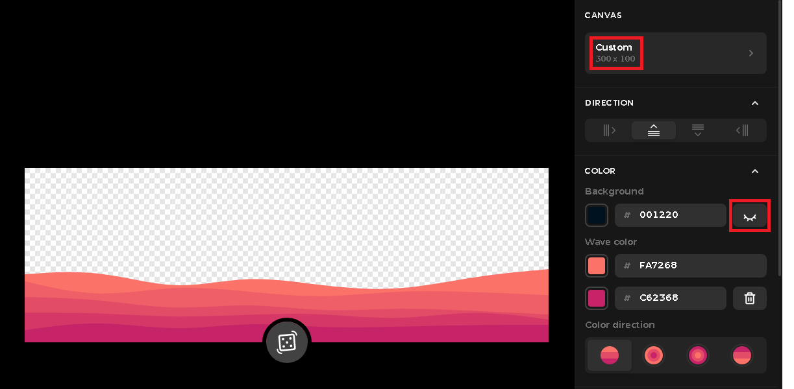

# How to create a new page
- Let's suppose you want to create an "Add Friends" page
- Go to the ```src``` directory and search for the ```Pages``` directory
- There, create a new folder called ```AddFriends``` and two files, an ```add-friends.tsx``` file and an ```add-friends.css``` file inside of it
- Write the page component with the following pattern:
```Typescript
import {React} from 'react';
import {useState,useEffect} from 'react'; // this is optional, obviously, but it's just a reminder that these shouldn't be imported in the same line as React class

import './add-friends.css';

function AddFriends() {
  const [something,setSomething] = useState();
  
  useEffect(() => {
    ...
  })

  return (
    <></>
  )
}

export default AddFriends;
```
- After the component is created and exported, go to the ```index.ts``` file in the Pages directory and write:
```Typescript
import AddFriends from './AddFriends/add-friends';

export {...,AddFriends};
```
- Then go back to the ```src``` directory and go to the ```App.tsx``` file, there you add the route for your page:
```Typescript
import {...,AddFriends} from './Pages';
...

function App() {
  ...
    <Route path="/add-friends" element={<AddFriends />}></Route>
}
```
- After that, go to the ```app.py``` file in the root directory, there you need to add the new ```add-friends``` route:
```Python
@app.route('/add-friends')
```

# How to create a new wave
- You firstly need to associate the wave with a genre key, to do that, you need to search for spotify genre keys, you can do it manually by looking at the genre seeds of your top items <a href="https://developer.spotify.com/console/get-current-user-top-artists-and-tracks/">here</a>
- After you have gotten the genre key, open <a href="haikei.app" target="_blank">haikei.app</a> and search for the option "Layered Waves"
- There you should create an wave with darker colors below and clearer colors above, also with these configs:



- Once you have found a good color palette, download the svg file and name it this way: ```{YOUR GENRE KEY HERE}-waves.svg```, then put the file in the ```Assets/Svg``` directory found in the ```src``` directory
- After this, go to the ```Helpers``` directory in ```src``` directory and go to the ```getTopGenre.ts``` file, there you assign your genre key in the ```genreKeyWords``` const, this way:
```Typescript
const genreKeyWords = [...,'{YOUR GENRE KEY HERE}'];
```
- Then go to the ```profile.css``` file in the ```Pages/Profile``` directory, there search for the wave classes, then put your wave class this way:
```Css
.wave-{YOUR GENRE KEY HERE} {
  background-image: url(../../Assets/Svg/{YOUR GENRE KEY HERE}.svg);
}
```
